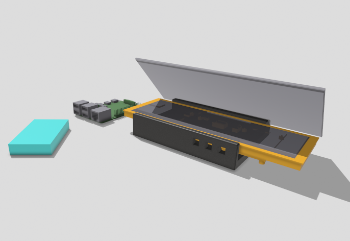
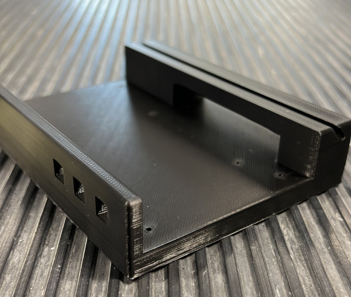
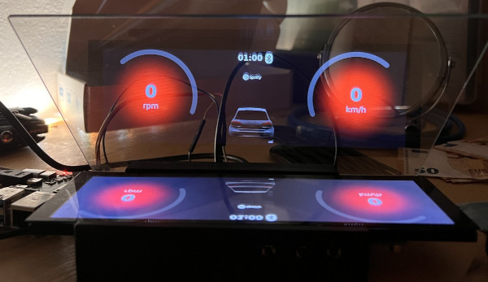
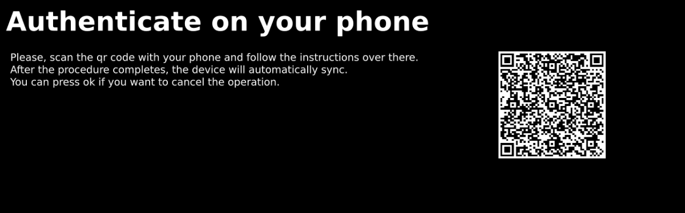

# Raspberry Pi QtQuick Head-up Display (HUD)
<p align="center">
    <strong>Messing around with boot2qt, qtquick, qtquick3d.</strong>
    <br>
    <br>
    
    
</p>

## What is this Project All About?
- I've used this project to explore Qt and Boot2Qt in the context of automotive applications.
- It involves creating a Head-up Display (HUD) for car use. I really wanted to be able to glance the lyrics of the song I'm listening to with Spotify in my old VW Golf. I've tried to realize a "usable" prototype. It also involves reading some ECU's information like current speed and RPM through the use of the ELM327 OBDII usb interface.
- Note: This project is not affiliated with Volkswagen (VW) or any other car manufacturer.
- DISCLAIMER: I'm not in ANY WAY promoting the use of this project on open roads given its experimental development status. Driving is A SERIUOS THING: don't distract yourself and don't be a menace to the other road's users.

## Prototype
To make everything more interesting, I've built and tested a real prototype running the software.  
I've built a custom Linux Image using Boot2Qt and Yocto, with a commercial student license.  
If interested you can open a discussion and I will try to find the time to upload the Yocto recipes, but you can build them with the information inside of this readme.  

Other than a Raspberry Pi 4B, the prototype is using:  

- This 7.9 inch [Display](https://www.waveshare.com/wiki/7.9inch_DSI_LCD), the aspect ratio is perfect for this use case. It reduces distraction while driving with it's low profile
- ELM327 USB dongle, any of the various version should be ok, but be sure that is compatible with your car.
- Beamsplitter glass: whatever is shown by the display is projected onto this panel to obtain a the class "see through" effect of HUD displays. I've got mine here [telepromptermirror.com](https://telepromptermirror.com, "Url")
- Based on the display specs, I've designed a 3D printable case for the whole thing. There also three holes in which three GPIO push button should be installed to control the software. (Check the rest of the readme).

<p align="center">
    
    
    
</p>

## Features
- Spotify API integration: login with your account through a QR code, see what you're listening to, check the lyrics of the current playing song.  
<p align=center>
    
</p>
- Glance the current cruising speed and the engine's RPMs.
- Internet access: needed to use Spotify. Since the application is supposed to be running on a Raspberry Pi in your car, internet access is obtained by using the Bluetooth NAP (Network Access Protocol) profile.
- A local network between your phone and the Pi is established when connecting the two devices.
- The whole application guide you through the configuration process. It also manages (using the Linux Bluetooth Stack (bluez)) known bluetooth devices to connect to them later.
- The feature has been correctly tested with an iPhone 13 running the latest version of iOS, but it should also work with Android smartphones, or literally anything supporting Bluetooth NAP. Remember to enable the " internet hotstpot" feature on your phone before doing anything.  
<p align=center>
    
</p>

## Tested Platforms
- Raspberry Pi 4B, GPIO Push Button, ELM327-USB, 7.9 Inch Display, Beamsplitter Glass. If you use the same configuration in the project you can find the 3D structure I've designed and print it.
- Virtual Box Debian 12 machine: Since using the Pi to do the whole development would have been quite annoying, the application has been developed so that it can also run in a testing environment by using mocks and fallbacks (mostly for the GPIO and ELM interface). 
 

## Testing and Building
- Based on the platform you are trying to compile for, you might feel the need to mess around with the configuration inside the CMakeLists.txt
- The architecture you are compiling for (ARM or x86) determines wether the PiGPIO library is included and used. In case of an x86 architecture you can control the app by using the keyboard instead of the GPIO buttons.
- Depending on your architecture you will have:
    - GPIO Button 17 or Left arrow: Loops through screens
    - GPIO Button 22 or Space: select button, also loops through colors in the main screen.
    - GPIO Button Right arrow: Scroll suboption in each screen.

- Moreover, there are other variables you have to configure in the CMakeLists:
```cmake
#specify the lyrics end point based on . I suggest to host your personal server. See more details under "Issues"
set(APPEND LYRICS_ENDPOINT "")

#Specify the port the HTTP server needed to handle the Spotify user authentication is listening to 
set(HTTP_SERVER_PORT 8080)

#Spotify API client id
set(CLIENTID )

#Spotify API client secret
set(CLIENT_SECRET "")

#USB Product ID for your ELM device (it may vary based on the version you've got)
set(ELM_DEVICE_PRODUCT_ID 2348)

#If set to true it won't use the ELM
set(ENABLE_CAR_CRUISING_MOCKS true)

```

- I suggest you to compile the app by using QtCreator. QtCreator also comes with a nice remote debugging feature you can configure to deploy and cross compile to the Pi or the Virtual Machine.
- Be sure to have Qt 6.4.2 sdk installed, specifically you need only some modules:.
-You can install the right sdk by using the wonderful [aqt](https://github.com/miurahr/aqtinstall) tool

```bash
#Inside the Qt sdk folder (for x86)
aqt install-qt linux desktop 6.4.2 gcc_64 -m qtquick3d qtconnectivity \
qtwebsockets qtserialport qthttpserver qt5compat
```

- For cross compiling on the Pi I've used the boot2qt toolchain which is part of the commercial Qt license.
But a good start for who is not using it is https://github.com/UvinduW/Cross-Compiling-Qt-for-Raspberry-Pi-4

## Dependencies and Installation
- The project requires several dependencies, including libraries for Bluetooth and GPIO interfaces, which have to be installed in the operating system.
- It is compatible only with Linux x86 (tested with Debian 12) and Linux ARM (specifically on Raspberry Pi, with Boot2Qt and Raspbian).
- Qt Version: The project has been tested with Qt 6.4.2 which comes as of this day as a default package in Debian and Raspbian. In case this is no longer true I suggest looking at AQT to install the right packages.

- Beside the qt and qml dependecies, udhcpc is used as dhcp server to obtain an ip address from the Bluetooth NAP network, bluez is used as a bluetooth stack. The application communicate with it by using dbus.
```bash
sudo apt install qt6-base-dev qt6-connectivity-dev qml6-module-qtquick-shapes \
qt6-httpserver-dev qt6-serialport-dev qt6-5compat-dev qt6-quicktimeline-dev \
qml6-module-qtqml-workerscript qml6-module-qtqml qtscript5-dev \
qml6-module-qtquick qml6-module-qtqml \
qml6-module-qtquick-scene3d qml6-module-qtquick-window \
qml6-module-qtquick-controls qt6-quick3d-dev \
qml6-module-qtquick-layouts qml6-module-qtquick-templates \
qml6-module-qt5compat-graphicaleffects udhcpc bluez
```
- After installing the dependencies you can just run the app
```bash
./DashboardApp
```


## Last notes
- The application must run with root privileges for full functionality.
- It has been tested on an x86 virtual machine and a Raspberry Pi with a custom-built Boot2Qt environment using Yocto. Discussions about publishing this build are ongoing, subject to licensing considerations. Should be ok running it inside Raspbian

## Issues
- Issues with ELM hardware and software: connection pretty unstable, probably depends on the cheap usb adapter I've used).
- Inconsistencies with lyrics display due to API limitations: sadly as you can see also in the repo I've linked under the aknwoledgements, Spotify is limiting the Lyrics feature to Premium account only. This means that to use fully the Lyrics feature inside this project you must host your own API endpoint with your premium account. The one used inside the repo might not always work.

## Acknowledgments
Huge thanks to the author of various libraries I've used:
- ELM Qt-Based abstraction by [GitHub Snipesy/Elm327-Qt-Primitive-Implementation ](https://github.com/Snipesy/Elm327-Qt-Primitive-Implementation)
- The Spotify Lyrics endpoint code by [GitHub akashrchandran/spotify-lyrics-api](https://github.com/akashrchandran/spotify-lyrics-api)
- Modern Http abstration used to access the Spotify API by [GitHub flaviotordini/http](https://github.com/flaviotordini/http)
- The QR Code Generator library: used to provide the login url from the Spotify API by [GitHub nayuki/QR-Code-generator](https://github.com/nayuki/QR-Code-generator)
